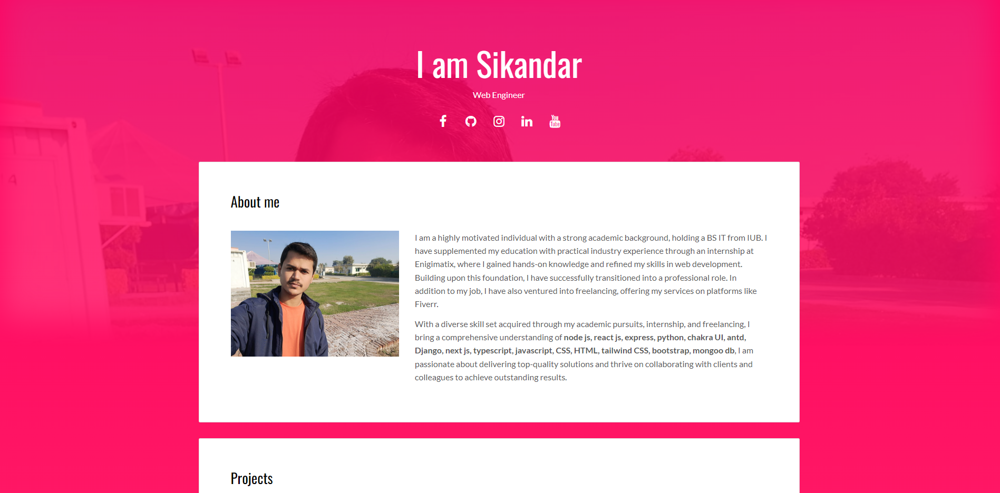
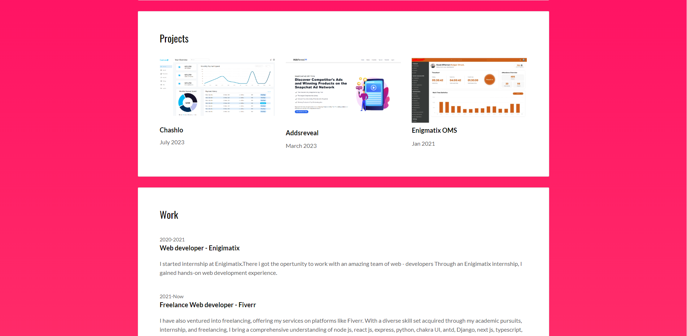
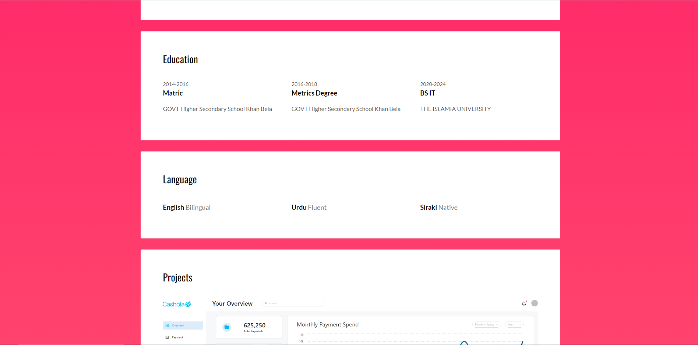
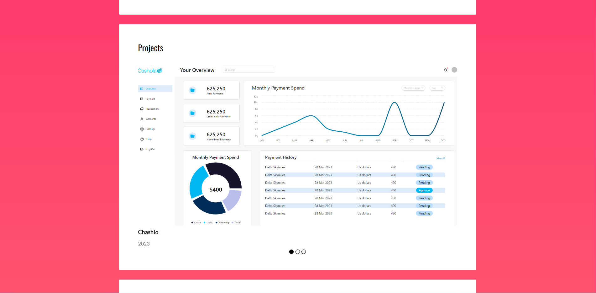
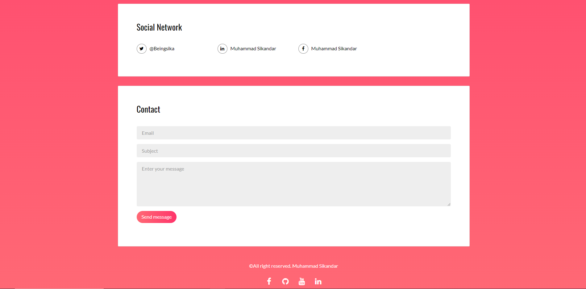

# Portfolio Website

Welcome to portfolio website! This site is designed to showcase
projects, share professional experience, and highlight education and
skills.I developed this website for my friend

- [Find me on fiver ](https://www.fiverr.com/zainbinramzan/develop-web-applications-with-mern-stack-react-node-express-moongodbplugin-react/README.md)
- [Find me on linkedin](https://www.linkedin.com/in/abu-zain-html-css-javascipt-developer/)

## Features

- **Project Showcase:** View details and demos of personal projects.
- **Experience:** Explore professional background and work experience.
- **Education:** Learn about educational qualifications and
  achievements.
- **Skills:** Discover the skills and technologies he is proficient
  in.
- **Contact:** Get in touch with him through the provided contact
  information.

## Tech Stack

- **Backend:** Developed using Python Flask.
- **Frontend:** HTML and CSS for a clean and responsive design.

## Project Structure

The project follows a simple structure:

- `app.py`: The main Flask application file.
- `templates/`: Contains HTML templates for different pages.
- `static/`: Includes CSS files and other static assets.

## Getting Started

1. Clone the repository.
2. Install Flask using `pip install flask`.
3. Run the Flask application with `python app.py`.

## Customization

Feel free to customize the HTML templates and CSS files to match your
preferences and add your personal touch to the website.

## Deployment

You can deploy this portfolio website on platforms like Heroku or
GitHub Pages for easy accessibility.

## Contributing

If you have suggestions or improvements, please open an issue or
submit a pull request. Contributions are welcome!
